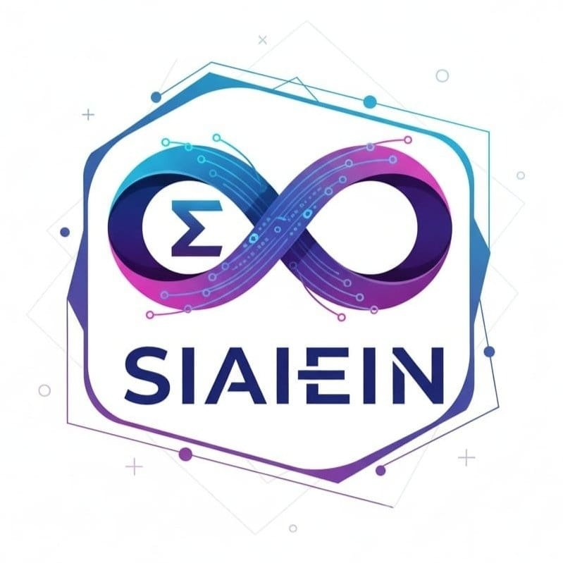

# SIAIEIN - Agentic AI Infrastructure



**SIAIEIN** is a cutting-edge, premium web application built to showcase next-generation Agentic AI solutions for enterprise automation. This platform highlights how autonomous AI agents replace repetitive manual work across various industries.

## 🌟 Key Features

- **Premium Modern Aesthetics**: Striking dark-mode design with glassmorphism, dynamic gradients, and smooth scroll reveals.
- **Interactive Agent Demos**: A built-in terminal-style simulation system that allows users to watch realistic AI agents (Sales, Support, Research, etc.) execute complex workflows in real-time.
- **Fluid Animations**: Leveraging Framer Motion for highly interactive components, micro-interactions, and parallax background effects.
- **Mobile-First Responsive Design**: Flawless experience across all device sizes, featuring custom responsive grids, fluid typography, and an off-canvas mobile navigation menu.
- **Performance Optimized**: Built on Next.js App Router for optimal Server-Side Rendering (SSR) and SEO performance.

## 🛠️ Tech Stack

- **Framework**: [Next.js](https://nextjs.org/) (React framework)
- **Styling**: [Tailwind CSS](https://tailwindcss.com/)
- **Animations**: [Framer Motion](https://www.framer.com/motion/)
- **Icons**: [Lucide React](https://lucide.dev/)
- **Components**: Custom UI library inspired by Radix/shadcn principles 

## 🚀 Getting Started

Follow these instructions to get the project running on your local machine.

### Prerequisites

- Node.js 18.x or higher
- npm, yarn, or pnpm

### Installation

1. Clone the repository:
   ```bash
   git clone https://github.com/your-username/siaiein-website.git
   cd siaiein-website
   ```

2. Install the dependencies:
   ```bash
   npm install
   # or
   yarn install
   # or
   pnpm install
   ```

3. Run the development server:
   ```bash
   npm run dev
   # or
   yarn dev
   # or
   pnpm dev
   ```

4. Open [http://localhost:3000](http://localhost:3000) with your browser to see the result.

## 📂 Project Structure

- `src/app/` - Next.js App Router pages and layouts.
- `src/components/` - Reusable React components.
  - `layout/` - Navbar, Footer, etc.
  - `ui/` - Buttons, Cards, Animated Text, DemoModal, etc.
- `src/lib/data/` - Centralized data configurations (e.g., the 18 demo simulations, service details).
- `public/` - Static assets, images, and fonts.

## 🚀 Deployment Guide

This project is fully configured for a production-ready **Static HTML Export**, which makes it incredibly fast, completely secure, and fully compatible with any standard web host, including Hostinger.

### Step 1: Push to GitHub
1. Initialize Git (if you haven't already):
   ```bash
   git init
   git add .
   git commit -m "Initial commit"
   ```
2. Create a new repository on GitHub (leave it completely empty, no README or .gitignore).
3. Link your local directory to GitHub and push:
   ```bash
   git remote add origin https://github.com/your-username/your-repo-name.git
   git branch -M main
   git push -u origin main
   ```

### Step 2: Deploy to Hostinger (Static Export)
Because this is a Next.js App Router application built for maximum performance, you only need to upload the compiled static files to Hostinger.

1. **Build the Project**
   Run the following command locally to generate the production-ready static files:
   ```bash
   npm run build
   ```
   *Note: This utilizes the `output: "export"` configuration in `next.config.ts` to generate an `out` directory.*

2. **Upload to Hostinger**
   - Log in to your Hostinger hPanel.
   - Go to **Websites** -> Manage your domain -> **File Manager**.
   - Navigate to the `public_html` directory of your domain.
   - Compress the **contents** of your local `out/` folder into a `.zip` file (do not zip the folder itself, zip the files *inside* it).
   - Upload the `.zip` file to `public_html` via the Hostinger File Manager.
   - Right-click the uploaded `.zip` and select **Extract**.
   - Delete the `.zip` file.

3. **Validation**
   Your website is now live! Visit your domain to see the production build running at hyper-speed.

---

*Architected with OpenAI, Anthropic, LangChain, CrewAI, n8n, and AWS.*
*Imagination + AI = Innovation*
